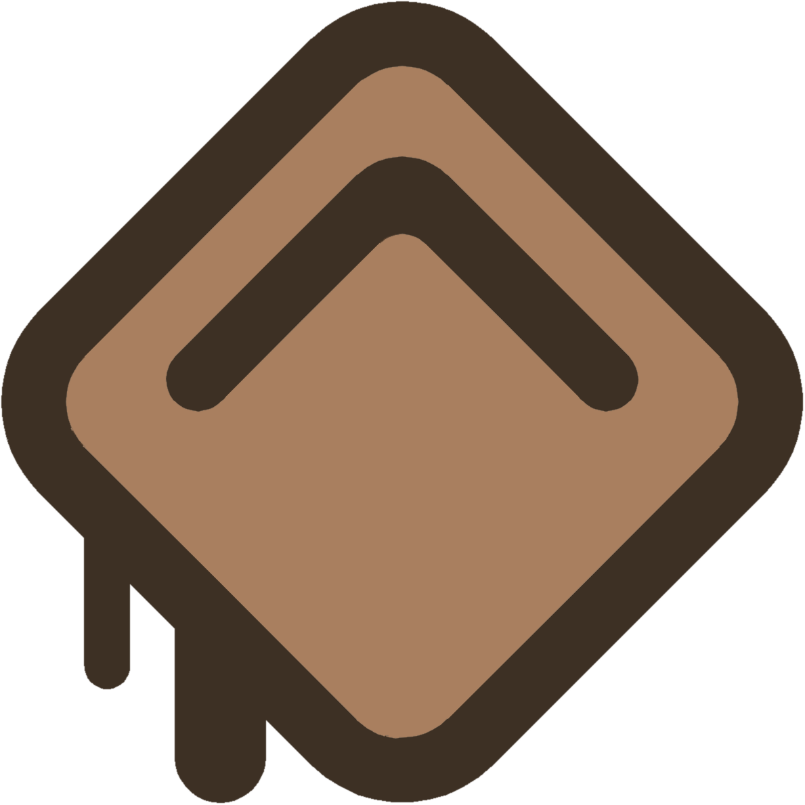

# CocoaTabs Clicker 🍫

## You must have [Python](https://www.python.org/downloads/) installed!

Python grid based clicker.

This solution will allow you to automate the process of clicking on multiple spots spread across a grid.

##  Why download it? 🌱

This tool proves invaluable for repetitive tasks that involve clicking on specific grid intersections. Whether it's collecting data points from a structured spreadsheet, automating GUI testing, or assisting in pixel-perfect design verification, CocoaTabs Clicker significantly enhances productivity and accuracy by simplifying the process of precise mouse clicks.

**Warning:** CocoaTabs may not work properly in desktop environments with customized themes and configurations.

##  Installation 🛠️

1. Visit the [Downloading](https://github.com/sad-gabi/CocoaTabs/wiki/Downloading) documentation page and follot its intrsuctions.

6. Once downloaded, follow the instructions provided at [Installing](https://github.com/sad-gabi/CocoaTabs/wiki/Installing)

##  How to use 📖

1. Once you execute the app, two new windows will appear:

  - The **CocoaTabs Grid** window allows you to view, move and adjust the size of the grid across your screen.
  
  - The **CocoaTabs Console** window allows you to change the number of columns and rows of the grid. Once you entered an input, you can view the new grid by clicking on the **Draw Grid** button. To start the clicker, click on the **Click Grid** button.

    **Don't move your mouse until the clicking process is finished!**

2. Once the clicking process has finished, you can close the app by clicking on the **Close App** button.
